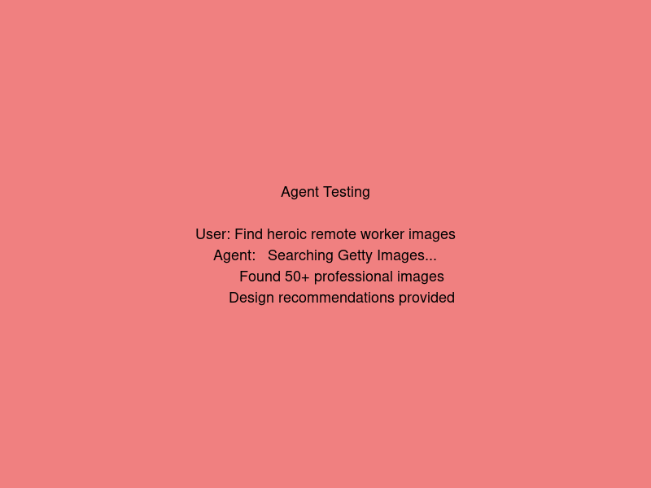

# Create a Design Agent with Getty Images Custom Connector

Build an intelligent Design Agent that leverages Getty Images API through a custom REST connector to help users find, suggest, and discuss professional imagery for their creative projects.

---

## 🧭 Lab Details

| Level | Persona | Duration | Purpose |
| ----- | ------- | -------- | ------- |
| 200   | Intermediate Maker | 45 minutes | After completing this lab, participants will be able to create a sophisticated Design Agent using Microsoft Copilot Studio with a custom REST API connector. They will master custom connector creation, API authentication, response mapping, and agent orchestration to build an intelligent assistant that can search Getty Images, provide design recommendations, and guide creative decision-making processes. |

---

## 📚 Table of Contents

- [Why This Matters](#-why-this-matters)
- [Introduction](#-introduction)
- [Core Concepts Overview](#-core-concepts-overview)
- [Documentation and Additional Training Links](#-documentation-and-additional-training-links)
- [Prerequisites](#-prerequisites)
- [Summary of Targets](#-summary-of-targets)
- [Use Cases Covered](#-use-cases-covered)
- [Instructions by Use Case](#️-instructions-by-use-case)
  - [Use Case #1: Create Design Agent and Custom Getty Images Connector](#-use-case-1-create-design-agent-and-custom-getty-images-connector)
  - [Use Case #2: Configure Agent Intelligence and Test Design Workflows](#-use-case-2-configure-agent-intelligence-and-test-design-workflows)

---

## 🤔 Why This Matters

**Working with creative teams or marketing?** You know the pain of spending hours searching for the perfect image, only to settle for generic stock photos that don't capture your vision. Custom connectors in Copilot Studio change everything!

Think of building a Design Agent like hiring a creative assistant:
- **Without a Design Agent**: Teams waste time browsing through hundreds of irrelevant images, struggle to find consistent visual themes, and make design decisions without professional guidance
- **With a Design Agent**: Users get instant access to curated Getty Images content with AI-powered recommendations, thematic suggestions, and intelligent design guidance based on industry best practices

**Common challenges solved by this lab:**
- "Our team spends too much time searching for appropriate imagery for campaigns"
- "We need professional-quality images but don't know how to find them efficiently"
- "Our design choices lack consistency and professional guidance"
- "We want to integrate high-quality image search into our creative workflow"

**The 45 minutes you invest in this lab will revolutionize how your team approaches visual content creation!**

---

## 🌐 Introduction

Modern creative workflows demand immediate access to professional-quality imagery with intelligent search capabilities. This lab guides you through creating a sophisticated Design Agent that not only searches Getty Images through a custom REST connector but also provides intelligent design recommendations, color palette suggestions, and creative guidance.

**Real-world scenario:** Imagine a marketing team member asks: "I need heroic lifestyle images of remote workers for our productivity campaign, preferably with warm color tones and diverse representation." Your Design Agent will:
1. Search Getty Images using optimized query parameters
2. Filter results based on visual characteristics (color, mood, composition)
3. Analyze image metadata for diversity and representation
4. Provide design rationale and usage recommendations
5. Suggest complementary images for campaign consistency

This level of creative intelligence transforms time-consuming image searches into strategic design conversations, elevating both efficiency and creative output quality.

---

## 🎓 Core Concepts Overview

| Concept | Why it matters |
|---------|----------------|
| **Custom REST Connector** | Enables direct integration with any REST API (like Getty Images) beyond pre-built connectors, giving you unlimited flexibility to connect with specialized services. |
| **API Authentication** | Secures your connector with proper credentials management, ensuring authorized access to premium services while protecting your API keys and usage limits. |
| **Response Mapping** | Transforms complex API responses into usable data for your agent, allowing intelligent processing of image metadata, licensing info, and search results. |
| **Design Intelligence** | Combines AI reasoning with professional design principles to provide contextual recommendations, not just search results, enhancing creative decision-making. |
| **Visual Search Parameters** | Leverages advanced API features like color filters, image orientation, and content type to deliver precisely targeted visual content that matches creative briefs. |
| **Workflow Orchestration** | Chains multiple connector calls and AI reasoning to create sophisticated design workflows that guide users from concept to final asset selection. |

---

## 📄 Documentation and Additional Training Links

* [Create a custom connector from a blank connector](https://learn.microsoft.com/en-us/microsoft-copilot-studio/advanced-custom-connector-creation)
* [Use custom connectors in Copilot Studio](https://learn.microsoft.com/en-us/microsoft-copilot-studio/advanced-connectors)
* [REST connector configuration](https://learn.microsoft.com/en-us/microsoft-copilot-studio/advanced-custom-connector-rest)
* [Authentication in custom connectors](https://learn.microsoft.com/en-us/microsoft-copilot-studio/advanced-custom-connector-authentication)
* [Getty Images API Documentation](https://developers.gettyimages.com/)

---

## ✅ Prerequisites

* Access to Microsoft Copilot Studio with custom connector creation permissions
* Getty Images API key (can use demo/sandbox mode for testing)
* Environment with the following data loss prevention policies NOT blocked:
  - Custom connectors in Copilot Studio
  - HTTP connectors with authentication
  - External API connections
* Basic understanding of REST APIs and JSON responses

---

## 🎯 Summary of Targets

In this lab, you'll create a sophisticated Design Agent that transforms how teams discover and select professional imagery. By the end of the lab, you will:

* Create and configure a custom REST connector for Getty Images API integration
* Build an intelligent Design Agent with natural language processing capabilities
* Implement advanced search and filtering logic for visual content discovery
* Configure proper API authentication and response handling
* Design conversation flows that guide users through professional creative processes
* Test and validate end-to-end design workflows with real image searches

---

## 🧩 Use Cases Covered

| Step | Use Case | Value added | Effort |
|------|----------|-------------|--------|
| 1 | [Create Design Agent and Custom Getty Images Connector](#-use-case-1-create-design-agent-and-custom-getty-images-connector) | Build the foundation with a professional-grade API connector that gives your agent access to millions of high-quality Getty Images assets | 25 min |
| 2 | [Configure Agent Intelligence and Test Design Workflows](#-use-case-2-configure-agent-intelligence-and-test-design-workflows) | Transform raw search capabilities into intelligent design guidance with natural language processing and workflow orchestration | 20 min |

---

## 🛠️ Instructions by Use Case

---

## 🧱 Use Case #1: Create Design Agent and Custom Getty Images Connector

Build your agent foundation with a sophisticated REST connector that provides secure, authenticated access to Getty Images professional content library.

| Use case | Value added | Estimated effort |
|----------|-------------|------------------|
| Create Design Agent and Custom Getty Images Connector | Build the foundation with a professional-grade API connector that gives your agent access to millions of high-quality Getty Images assets | 25 minutes |

**Summary of tasks**

In this section, you'll create a new Copilot Studio agent, configure a custom REST connector for Getty Images API, implement proper authentication, and establish the core search functionality.

**Scenario:** Your creative team needs immediate access to professional imagery with intelligent search capabilities. Rather than manually browsing stock photo sites, they want to describe their creative vision and receive curated recommendations through natural conversation.

### Objective

Create a fully functional Design Agent with authenticated Getty Images API access, capable of understanding creative requests and returning relevant professional imagery with metadata.

---

### Step-by-step instructions

#### Create your Design Agent

1. Navigate to [copilotstudio.microsoft.com](https://copilotstudio.microsoft.com) and select **Create** in the top navigation.

2. Choose **New agent** to start building from scratch.

3. Select **Skip to configure** to bypass the conversation-based setup.

4. Configure your agent with these details:
   - **Name**: `Creative Design Assistant`
   - **Description**: `An intelligent design agent that helps find, recommend, and discuss professional imagery from Getty Images for creative projects`

5. Select **Advanced settings** (...) and ensure your agent is created in an appropriate solution for deployment and management.

6. Select **Create** to initialize your agent.


#### Set up the Custom Getty Images Connector

7. Once your agent is created, navigate to the **Tools** tab in the left navigation.

8. Select **+ Add a tool** and choose **Custom connector**.

9. Select **Create new** to build a connector from scratch.

10. In the connector setup, configure the basic information:
    - **Connector name**: `Getty Images Search`
    - **Description**: `Search and retrieve professional images from Getty Images API`
    - **Host URL**: `https://api.gettyimages.com`


#### Configure API Authentication

11. In the **Security** tab, set up authentication:
    - **Authentication type**: API Key
    - **API key parameter name**: `Api-Key`
    - **API key parameter location**: Header

12. Save your authentication configuration.

> [!IMPORTANT]
> You'll need a Getty Images API key. For this lab, you can use their sandbox environment or request a developer key from Getty Images developers portal.

#### Define the Search Action

13. Navigate to the **Definition** tab and select **New action**.

14. Configure the search action:
    - **Summary**: `Search Getty Images`
    - **Description**: `Search for images based on keywords, filters, and creative parameters`
    - **Operation ID**: `searchImages`
    - **Verb**: GET
    - **URL**: `/v3/search/images`

15. Add the following parameters:

    **Query Parameters:**
    - `phrase` (string, required): Search keywords and phrases
    - `sort_order` (string, optional): Values: `most_popular`, `newest`, `oldest`, `best_match`
    - `orientations` (string, optional): Values: `horizontal`, `vertical`, `square`
    - `number_of_people` (string, optional): Values: `none`, `one`, `two`, `group`
    - `page_size` (integer, optional): Number of results (max 100)
    - `page` (integer, optional): Page number for pagination


#### Configure Response Schema

16. In the **Response** section, define the expected JSON structure. Add this sample response to help Copilot Studio understand the data format:

    ```json
    {
      "result_count": 1000,
      "images": [
        {
          "id": "1234567890",
          "title": "Business team collaborating in modern office",
          "caption": "Diverse group of professionals working together",
          "thumb": {
            "url": "https://media.gettyimages.com/photos/business-team-photo?s=170x170"
          },
          "display_sizes": [
            {
              "name": "comp",
              "uri": "https://media.gettyimages.com/photos/business-team-photo?s=612x612"
            }
          ],
          "keywords": [
            {
              "text": "teamwork"
            },
            {
              "text": "business"
            }
          ]
        }
      ]
    }
    ```

17. Select **Create connector** to finalize your custom connector.

#### Test the Connector

18. Back in your agent's **Tools** section, find your newly created Getty Images connector.

19. Select **Add to agent** and configure the tool:
    - **Tool name**: `Search Professional Images`
    - **Description**: `Find high-quality professional images from Getty Images based on creative briefs and search criteria`

20. In the tool configuration, set up the connection:
    - Select **Create new connection**
    - Enter your Getty Images API key when prompted
    - Test the connection to ensure it's working


---

###  🏅 Congratulations! You've completed Use Case #1!

---

### Test your understanding

**Key takeaways:**

* **Custom REST Connectors** – Enable integration with any REST API service, expanding your agent's capabilities beyond pre-built connectors
* **API Authentication** – Properly securing your connectors protects your credentials and ensures reliable access to premium services
* **Response Schema Definition** – Helps Copilot Studio understand and intelligently process complex API responses for better agent reasoning

**Lessons learned & troubleshooting tips:**

* Always test your API key and connection before proceeding to avoid authentication errors during agent testing
* Use descriptive parameter names and descriptions to help the AI understand when and how to use different search options
* Start with simple search parameters and add complexity gradually to ensure each component works correctly

**Challenge: Apply this to your own use case**

* What other creative or professional APIs could benefit your organization's workflows?
* How might you modify the search parameters to better serve your specific creative team's needs?
* Consider how you could chain multiple API calls together for more sophisticated creative workflows

---

---

## 🔄 Use Case #2: Configure Agent Intelligence and Test Design Workflows

Transform your connector into an intelligent creative assistant with natural language understanding, design reasoning, and professional creative guidance.

| Use case | Value added | Estimated effort |
|----------|-------------|------------------|
| Configure Agent Intelligence and Test Design Workflows | Transform raw search capabilities into intelligent design guidance with natural language processing and workflow orchestration | 20 minutes |

**Summary of tasks**

In this section, you'll configure your agent's personality and reasoning capabilities, create sophisticated conversation flows, and test complete design workflows that guide users from creative brief to final image selection.

**Scenario:** Your Design Agent needs to understand creative language, provide professional design guidance, and help users make informed decisions about imagery that aligns with their brand and project goals.

### Step-by-step instructions

#### Configure Agent Instructions and Personality

1. Navigate to **Overview** > **Instructions** in your Design Agent.

2. Replace the default instructions with this comprehensive creative guidance:

```
You are a professional Creative Design Assistant specializing in visual content discovery and design guidance. Your expertise includes:

CORE CAPABILITIES:
- Search Getty Images using natural language creative briefs
- Provide design rationale and professional recommendations
- Understand color theory, composition, and visual hierarchy
- Guide users through creative decision-making processes

SEARCH BEHAVIOR:
When users describe their visual needs:
- Extract key visual elements (mood, style, subject, color, composition)
- Translate creative language into effective search parameters
- Use specific Getty Images search filters for optimal results
- Always search with multiple complementary queries when helpful

RESPONSE STYLE:
- Lead with design insights, not just search results
- Explain why certain images work for specific use cases
- Provide context about visual trends and best practices
- Ask clarifying questions to refine creative direction
- Suggest alternatives and variations

PROFESSIONAL GUIDANCE:
- Consider brand consistency and visual identity
- Recommend appropriate image usage and licensing
- Suggest complementary images for cohesive campaigns
- Provide context about visual communication principles

CONVERSATION FLOW:
1. Understand the creative brief and project context
2. Search for relevant imagery using optimized parameters
3. Present results with design rationale
4. Offer refinements and alternatives
5. Guide final selection with professional recommendations

Always be helpful, creative, and professional while maintaining expertise in visual design and communication.
```

3. **Publish** your agent to save the instructions.


#### Configure Advanced Search Logic

4. Navigate to the **Topics** tab and select **+ Add a topic**.

5. Create a new topic called `Creative Image Search` with these trigger phrases:
   - "I need images for"
   - "Find me photos of"
   - "Show me visuals for"
   - "Search for imagery"
   - "Help me find pictures"

6. In the topic authoring canvas, add a **Question** node:
   - **Question**: "I'd love to help you find the perfect imagery! Can you describe your creative vision? Include details like mood, style, subjects, colors, or any specific requirements."
   - **Save response to**: `CreativeBrief` (Text variable)

7. Add a **Generative answers** node and configure it:
   - **Data source**: Getty Images Search tool
   - **Content moderation**: Strict
   - **Custom system message**:
     ```
     Based on the user's creative brief, search for professional imagery that matches their vision. 
     
     Use these guidelines for search optimization:
     - Extract key visual elements and mood descriptors
     - Use specific, descriptive search terms
     - Consider orientation, number of people, and composition needs
     - Prioritize the most relevant and highest quality results
     
     Present results with:
     - Brief description of why each image fits their brief
     - Design rationale and usage suggestions
     - Alternative search directions if needed
     
     Always maintain a professional, creative tone while being helpful and insightful.
     ```


#### Add Design Refinement Flow

8. After the generative answers node, add a **Question** node:
   - **Question**: "Would you like me to refine the search with different parameters, find similar images, or explore a different creative direction?"
   - **Options**: 
     - "Refine current search"
     - "Find similar images"
     - "Try different direction"
     - "These look perfect"

9. For each option, create appropriate follow-up actions:
   - **Refine**: Ask for specific adjustments (colors, mood, composition)
   - **Similar**: Use the same search with variation parameters
   - **Different**: Start a new creative exploration
   - **Perfect**: Provide usage and licensing guidance

#### Test the Complete Workflow

10. In the **Test your agent** panel, try these comprehensive test scenarios:

    **Test 1 - Marketing Campaign:**
    ```
    I need heroic lifestyle images of remote workers for our productivity campaign, preferably with warm color tones and diverse representation.
    ```

    **Test 2 - Website Header:**
    ```
    Find me a horizontal header image for our tech startup's website - something modern, energetic, showing collaboration but not too busy.
    ```

    **Test 3 - Social Media:**
    ```
    I need square format images for Instagram - professional but approachable, showing customers using our product in real-world settings.
    ```



11. Evaluate the responses for:
    - Appropriate image search results
    - Professional design guidance
    - Creative reasoning and recommendations
    - Natural conversation flow

#### Fine-tune Agent Responses

12. Based on your testing, navigate to **Settings** > **Generative AI** to optimize:
    - **Response length**: Medium (for balanced detail and readability)
    - **Content filtering**: Medium (appropriate for professional creative content)
    - **Fallback behavior**: Provide alternative search suggestions

13. Test the refined configuration with various creative briefs to ensure consistent, professional responses.

#### Validate End-to-End Creative Workflow

14. Conduct a final comprehensive test with this realistic scenario:

    ```
    Our company is launching a new wellness app and needs imagery for our website hero section, social media campaign, and email marketing. The brand feeling should be calm, inclusive, and aspirational - think people finding balance in their daily lives. We need both individual portraits and lifestyle scenes, with a preference for natural lighting and authentic moments rather than overly posed shots.
    ```

15. Verify that your agent:
    - Understands the multi-faceted creative brief
    - Provides relevant Getty Images search results
    - Offers professional design guidance
    - Suggests complementary images for campaign consistency
    - Maintains engaging conversation throughout the process


---

###  🏅 Congratulations! You've completed the Custom Connector Design Agent lab!

---

### Test your understanding

* How does the custom connector approach differ from using pre-built connectors, and what advantages does it provide?
* What role do the agent instructions play in transforming raw API responses into intelligent creative guidance?
* How might you extend this Design Agent to include other creative services or workflow automation?

**Challenge: Apply this to your own use case**

* Consider other professional creative APIs (Adobe Stock, Unsplash, Shutterstock) - how would you adapt this connector pattern?
* How could you integrate this Design Agent with your existing creative workflow tools (Figma, Adobe Creative Suite, project management systems)?
* What additional creative intelligence features would benefit your specific organization's design processes?

---

## 🏆 Summary of learnings

True creative intelligence comes from combining technical API integration with professional design expertise—your Design Agent demonstrates both.

To maximize the impact of custom connectors in creative workflows:

* **API Integration Mastery** – Custom REST connectors unlock unlimited possibilities for specialized service integration, far beyond pre-built options
* **Professional Domain Knowledge** – Combining technical capabilities with industry expertise creates agents that provide real professional value
* **Intelligent Response Processing** – Properly configured agents transform raw API data into actionable insights and professional guidance
* **Conversation Design** – Well-structured conversation flows guide users through complex professional processes naturally and efficiently
* **Testing and Iteration** – Comprehensive testing with realistic scenarios ensures your agent performs reliably in real-world creative workflows

---

### Conclusions and recommendations

**Custom Connector Design golden rules:**

* Start with clear API documentation and test your endpoints thoroughly before building complex agent logic
* Design conversation flows that match real professional workflows, not just technical API capabilities
* Use descriptive parameter names and comprehensive instructions to help AI understand complex creative requirements
* Always provide fallback options and alternative suggestions when primary searches don't meet user expectations
* Regularly test with realistic, detailed creative briefs to ensure consistent professional-quality responses
* Consider the full creative workflow from brief to final selection, not just individual search interactions

By following these principles, you'll create intelligent agents that genuinely enhance professional creative workflows, providing both technical efficiency and strategic creative guidance that teams will rely on for their most important projects.

---